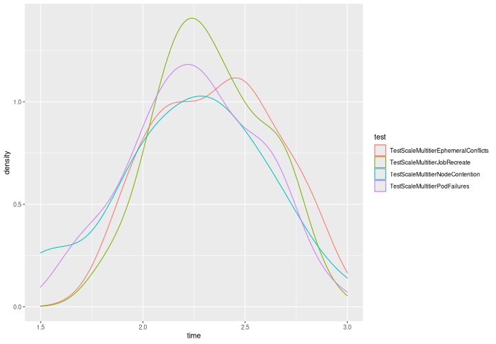

# End-to-end Testing

These tests assume a cluster reachable by kubeconfig. The deployment to be
tested needs to be made before running the tests, as described below.

Some tests also assume gcloud works. In particular, you must have your project,
location and cluster set (`gcloud config set project $YOUR_PROJECT`; `gcloud config
set container/cluster $YOUR_CLUSTER_NAME`).

The tests are prefixed to allow easy filtering, eg `go test -run TestMultitier -timeout 20m`.

It appears that using a zonal cluster has a lot of problems with the api server
going unreachable, especially for the many node pool creations in scale testing
However, the scale tests particually assume precise numbers of nodes in each
pool, so the default regional behavior of duplicating node pools across zones is
inconvenient. Instead, use a single-zone regional cluster as follows.

Note that GCS fuse must be enabled. `--workload-pool` is for workload identity,
which is used by GCS fuse.

```
gcloud container clusters create $CLUSTER_NAME \
  --region us-central1 --node-locations us-central1-a \
  --machine-type e2-standard-4 --num-nodes 3 \
  --release-channel None --addons GcsFuseCsiDriver \
  --cluster-version $some-recent-version \
  --workload-pool=$YOUR_PROJECT.svc.id.goog
```

The machine type default is more convenient than e2-mediums, which are often
too small for the controllers used.

It is necessary to not be in a release channel so that node pool auto upgrade
can be disabled (an upgrade will break a scale test).

The default region must be set for our gcloud commands to work. You can test by
running `gcloud container node-pools list`; this should list the node pools of
your cluster without any error.

## Multitier

Tests begin with `TestMultitier` and `TestScaleMultitier`.

```bash
make clean-multitier;
make multitier-images \
  PROJECT=$YOUR_PROJECT \
  MULTITIER_TAG=$CUSTOM_TAG_IF_NECESSARY

MULTITIER_TEST_GCS_BUCKET=$your_bucket \
go test -v -timeout 1h ./deploy_test -run TestMultitier
```

Note `MULTITIER_TEST_GCS_BUCKET` env var must be set.

The test will create node pools simlulating slices. There should be at least one
e2- or n2-standard-8 for running controllers (the jobset controller, installed below,
and the multitier controllers). The region and cluster need to be set in the
gcloud config, ie `gcloud config set compute/region XX` and `container/cluster`.

The multitier controller requires 4 CPUs in two pods; the jobset controller when
running at scale requires 1 (see below). Hence the need for the 8 CPU node.
More pods are required for kube-dns when there are many nodes in the cluster; a
node pool of 12-16 e2-standard-4s seems to do the trick.

The scale tests use e2-smalls with small boot disk in order to be deployable
without needing unusual quota. See `cluster_utils.go` for more details.

You need a bucket, eg

```bash
gcloud storage buckets create gs://$YOUR-BUCKET-NAME --location $SOME-REGION
```

Grant the node csi driver service account access to your gcs bucket

```bash
gcloud storage buckets add-iam-policy-binding gs://$YOUR_GCS_BUCKET \
    --member "principal://iam.googleapis.com/projects/$YOUR_PROJECT_NUMBER/locations/global/workloadIdentityPools/$YOUR_PROJECT.svc.id.goog/subject/ns/gke-managed-checkpointing/sa/gke-checkpointing-multitier-node" \
    --role "roles/storage.objectUser"
```

The job set controller must be installed (check to see if there's a more recent
release than v0.7.3). Note that e2-mediums are not sufficient to run the jobset
webhook (it needs 500m cores, or 1 if doing scale tests); e2-standard-4 should
be used instead.

```
kubectl apply --server-side -f https://github.com/kubernetes-sigs/jobset/releases/download/v0.7.3/manifests.yaml
```

If running scale tests on more than 10s of nodes, the jobset memory needs to be
increased:

```
  kubectl patch -n jobset-system deploy jobset-controller-manager --type json \
    --patch '[{"op": "add", "path": "/spec/template/spec/containers/0/resources", "value": {"limits": {"memory": "2Gi"}, "requests": {"cpu": "1", "memory": "1Gi"}}}]'
```

The `openssl` binary must be available, eg `apt install -y openssl`.

## Phase 1

See `README_PHASE1.md`.

## Multitier Performance Notes

The following was collected after thread contention reduction (the podsToDelete
and podsToAdd maps) along with the changes made at the same time to reduce
unnecessary refreshes.

3x512 nodes, restart overhead (time of last rank assignment - time of last pod
startup), 139 total runs (except for TestScaleMultitierEphemeralConflicts, each
test had two runs, one for setup and a second after failure.



Means
* TestScaleMultitierEphemeralConflicts  2.36
* TestScaleMultitierJobRecreate         2.33
* TestScaleMultitierNodeContention      2.23
* TestScaleMultitierPodFailures         2.25
